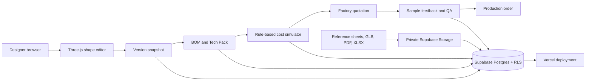

# Plush Studio — Product Architecture

Plush Studio is a browser-first 3D design and manufacturing collaboration service. The designer shapes a basic plush body in Three.js, converts its critical attributes into a versioned specification, tests commercial assumptions in a deterministic quotation engine, and then advances the same project through sample approval and production quality gates.

## Data path

## Access model

| Role | Core capability |
|---|---|
| Brand administrator | Creates organizations and projects, assigns members, freezes/approves versions, and confirms POs. |
| Designer | Edits 3D design, parts, BOM, cost scenarios, and manufacturing specification. |
| Factory | Sees assigned project specifications, contributes quotations and sample feedback. |
| QC | Reads assigned work and creates checklists, inspections, defects, corrective actions, and evidence records. |

Project access is enforced at the Supabase Row Level Security layer. Each private storage object starts with its organization UUID, allowing the storage policy to validate organization membership before returning a file.
